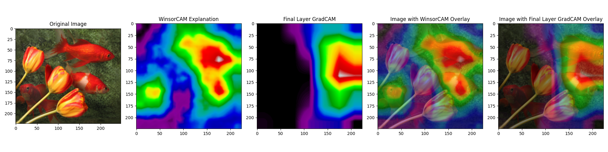
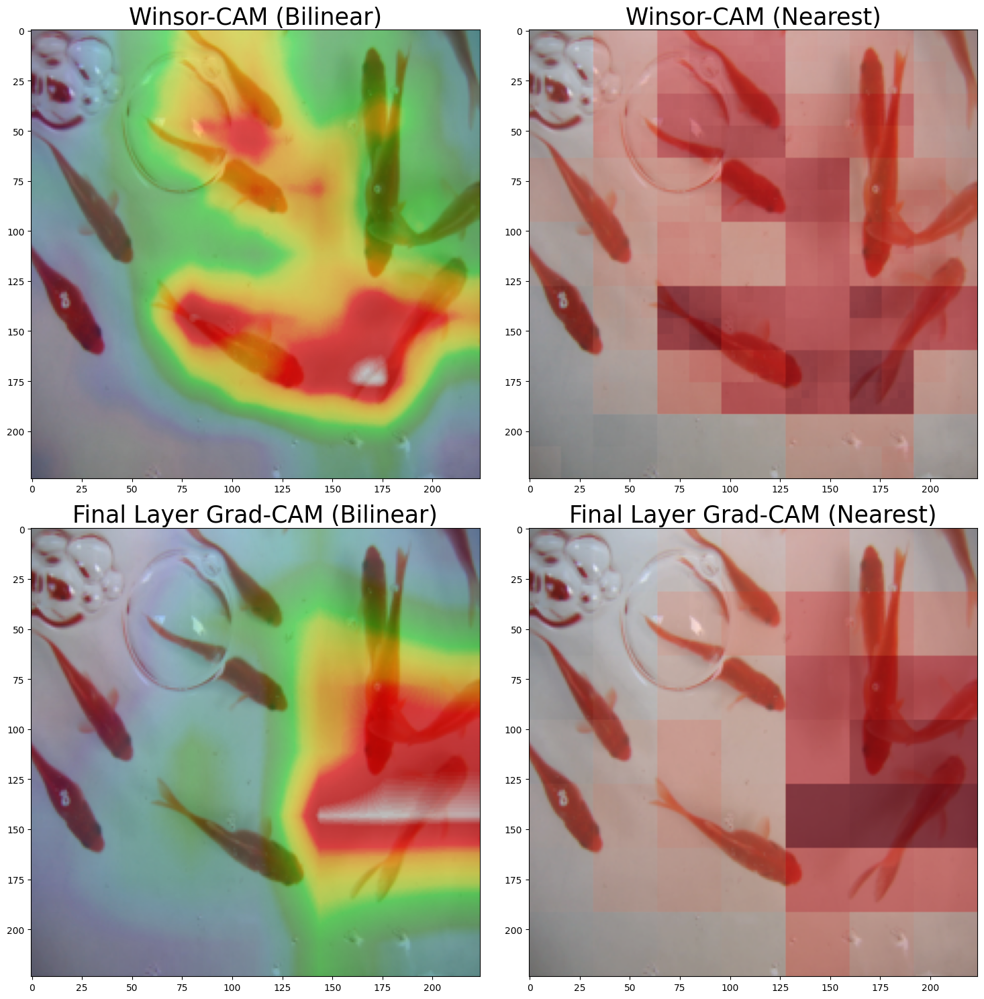
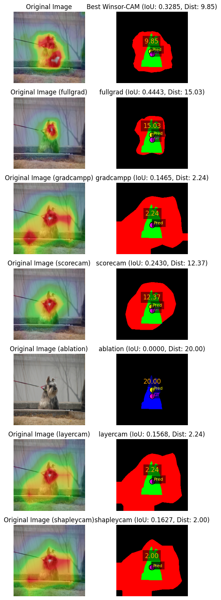

# WinsorCAM

## Overview
This is the repository for the WinsorCAM project, which is a tool for interprepting the results of a CNN model. The tool is designed to help users understand the model's predictions by providing visualizations of where a model is localizing feature that are indicative of a certain class. This repository contains Python code that allows users to easily pip install the the code necessaray to run the WinsorCAM algorithm, as well as example Jupyter Notebooks that demonstrate how to use the tool on the Pascal VOC and ImageNet datasets. The repository also includes output visualizations generated by the example notebooks, which can be found in the example folders.

## Usage

### Aquiring base pip package
To install the WinsorCAM package, you can use pip within your desired Python environment. Run the following command in your terminal:

```sh
pip install "winsorcam @ git+https://github.com/USD-AI-ResearchLab/Winsor-CAM.git"
```

to run the package you will also need to have PyTorch installed. You can find instructions for installing PyTorch on the [official PyTorch website](https://pytorch.org/get-started/locally/). Make sure to select the appropriate options for your system (e.g., operating system, package manager, Python version, and CUDA version if applicable) to get the correct installation command.

## Examples of WinsorCAM Visualizations
Here are some examples of the visualizations generated by the WinsorCAM algorithm:








### Using the Base WinsorCAM Package
Once you have the WinsorCAM package installed, you can use it in your Python code to generate visualizations for your CNN models. Here is a simple example of how to use the WinsorCAM package:

```python
import torch
from torchvision.models import densenet121
from torchvision import transforms
import torchvision.io as tvio
from winsorcam import WinsorcamClass
# loading a model
model = densenet121(weights="IMAGENET1K_V1")

model_usable_layer_names = [name for name, module in model.named_modules() if isinstance(module, torch.nn.Conv2d) and "AuxLogits" not in name]
# create an instance of the WinsorCAM class
winsorcam = WinsorcamClass(model, model_usable_layer_names)
# modify layer names
model_usable_layer_names = [f"model.{name}" for name in model_usable_layer_names]

# load an image and preprocess it
image_path = Path("./path_to_your_image")
image = tvio.read_image(str(image_path)).float()
transform = transforms.Compose([
    transforms.Resize((224, 224)),
    transforms.Lambda(lambda x: x / 255.0),  # Scale to [0, 1] before normalization
    transforms.Normalize(mean=[0.485, 0.456, 0.406], std=[0.229, 0.224, 0.225])
])
input_tensor = transform(image).unsqueeze(0)

# set models to evaluation mode
winsorcam.eval()
winsorcam.model.eval()

# get the predicted class using the model
with torch.no_grad():
    output = winsorcam.model(input_tensor)
predicted_class = torch.argmax(output, dim=1).item()

# In this case want to use all the layers available in the model for the explanation
# If other layers are desired then you will need to specify them here by indexes
desired_layer_names = model_usable_layer_names[:]

# now we that we have the predicted class, we can generate the gradcams and importance scores for that class
stacked_gradcam, gradcams, importance_tensor = winsorcam.get_gradcams_and_importance(
input_tensor=input_tensor,          # the input tensor to explain
target_class=predicted_class,       # the class index to explain
layers=desired_layer_names,         # the layers to use for the explanation
gradient_aggregation_method='mean', # method for aggregating gradients within the layers (mean is typically the only used option)
layer_aggregation_method='mean',    # method for aggregating importance scores across layers (mean or max are common options)
stack_relu=True,                    # whether to apply ReLU to the layer importance scores (should typically be True otherwise large negative importance per layer importance can modify)
                                    # implimetation of layer_relu=False has not been fully tested
interpolation_mode='bilinear'       # the interpolation mode to use when resizing the gradcams to the input image size
                                    # this heavily impacts the spatial aspects of the explanation
                                    # only pytorch interpolation modes are available
)

# now we create the winsorized version of the stacked gradcam
winsor_gradcam, winsor_importance = winsorcam.winsorize_stacked_gradcam(
        input_tensor, stacked_gradcam, importance_tensor,
        interpolation_mode="bilinear",
        winsor_percentile=90 # the percentile to use for winsorization
                            # use values between 0 and 100
                            # where higher values will result in layers with higher
                            # importance having more of their values preserved
                            # while lower value result in layers being weighted more equally
)

# from here you can visualize the winsor_gradcam in your preferred way, for example using matplotlib
```
### Running Example Notebooks
To run the example notebooks provided in the `./advanced_examples` and `./simple_examples` directories, you will need to install the optional dependencies for visualization. To run just the simple visualizations, you can install the `simple_vis` dependencies:

```sh
pip install "winsorcam[simple_vis] @ git+https://github.com/USD-AI-ResearchLab/Winsor-CAM.git"
```
To run the advanced visualizations, you can install the `advanced_vis` dependencies:

```sh
pip install "winsorcam[advanced_vis] @ git+https://github.com/USD-AI-ResearchLab/Winsor-CAM.git"
```
##### Running the Notebooks
Once you have the necessary dependencies installed, you can run the Jupyter Notebooks in the `./advanced_examples` and `./simple_examples` directories. To do this, navigate to the directory containing the notebook you want to run and start Jupyter Notebook:

```sh
jupyter notebook
```

This will open a new tab in your web browser where you can select the notebook you want to run. Click on the notebook to open it, and then you can run the cells in the notebook to see the visualizations generated by the WinsorCAM algorithm.


